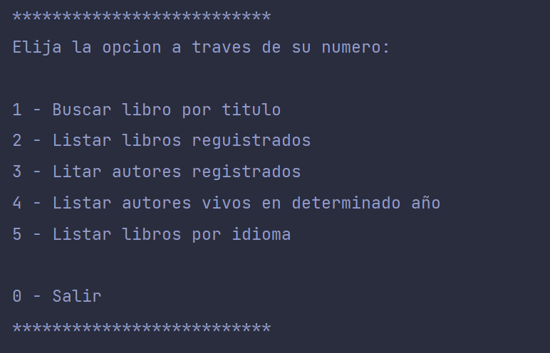

# LiterAlura-Challenge

Este proyecto fue creado como parte de mi proceso de aprendizaje. El objetivo principal era integrar la API Gutendex y almacenar los resultados en una base de datos PostgreSQL. El enfoque del proyecto se centra en funcionalidades específicas que permiten realizar operaciones básicas de gestión de libros.

## Características

El proyecto incluye las siguientes funcionalidades:

1. **Buscar Libro**: Permite buscar libros por título utilizando la API de Gutendex y guarda el primer resultado encontrado en la base de datos.

2. **Listar Libros**: Muestra por consola todos los libros guardados en la base de datos.

3. **Listar Autores**: Muestra por consola todos los autores guardados en la base de datos.

4. **Listar Autores vivos en determinado año**: Imprime por consola los autores que estaban vivos en un año específico, basado en la información almacenada en la base de datos.

5. **Listar Libros por Idioma**: Muestra en consola todos los libros que coinciden con el idioma buscado.

## Requisitos

Para ejecutar este proyecto, se requieren las siguientes tecnologías y herramientas:

- **Java JDK**: versión 17 o superior, disponible en Download the Latest Java LTS.
- **Maven**: versión 4 o superior, para la gestión de dependencias y construcción del proyecto.
- **Spring Boot**: versión 3.3.0, configurado a través de Spring Initializr.
- **PostgreSQL**: versión 14.12 o superior, como base de datos relacional. Configurado y conectado con SQL.
- **IDE**: Se recomienda IntelliJ IDEA, disponible en JetBrains, para el desarrollo integrado del proyecto.

## Dependencias para agregar al crear el proyecto en Spring Initializr

- **Spring Data JPA**: para la integración con la capa de persistencia.
- **PostgreSQL Driver**: para la conexión con la base de datos PostgreSQL.
- **Jackson**: para el manejo de JSON.

## Menu Principal de la aplicacion
